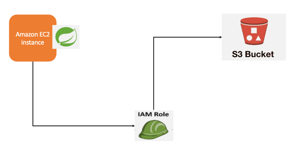

# S3 연습용 Repository 입니다.

## 환경
Java 11
SpringBoot 2.7.5
Thymeleaf
Spring Cloud AWS
Lombok

## 학습 내용
별도의 Configuration 파일 없이 `AmazonS3Client`를 DI 받을 수 있다. 
-> Spring Boot Cloud AWS를 사용하면 S3관련 Bean을 자동으로 생성해주기 때문이다.

따라서 아래 3개는 따로 설정할 필요가 없다.
- AmazonS3
- AmazonS3Client
- ResourceLoader

### 배포 환경에서 사용
aws.yml 파일은 git의 추적대상이 아니기 때문에 EC2에 배포해서는 동작하지 않는다.
따라서 EC2의 IAM Role을 활용한다.

> IAM 이란?
> Identity and Access Management(IAM)은 AWS 리소스에 대한 접근을 안전하게 제어할 수 있는 웹 서비스
> IAM을 사용하여 AWS 사용자 및 그룹과 AWS 서비스에 대한 권한을 생성하고 관리할 수 있다.
 
> IAM Role을 사용하게 되면 액세스 키가 동적으로 생성되어 임시로 사용자에게 제공된다.
> IAM Role은 일반적으로 AWS 리소스에 대한 액세스 권한이 없는 사용자, 애플리케이션 또는 서비스에 액세스 권한을 위임하는데 사용할 수 있다.
> 역할이 임시로 부여된 사용자는 원래 자신의 권한을 포기하는 대신 Role의 사용 권한을 부여 받는다.

## 참고 자료
https://jojoldu.tistory.com/300